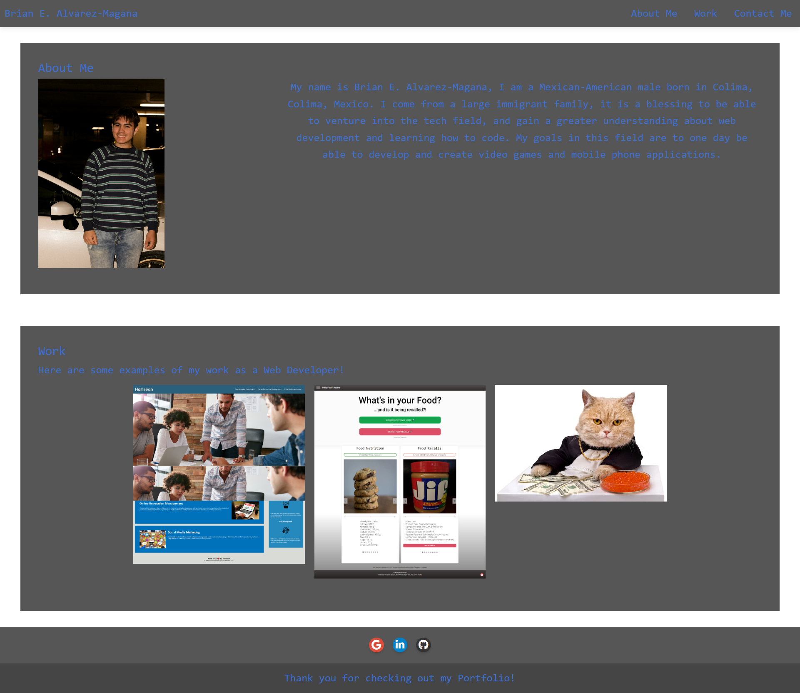

# 02 Advanced CSS: Portfolio

# Portfolio Brian Alvarez

## Usage

For future employers to be able to see my experience and coding abilities in a very neat and concise website.

## Description

The Portfolio I have created has a section for a small blurb about myself and my backgorund and goals in this field, my previous work and projects I have completed, 
and a section on where and how to reach / contact me.

## URL

## Screenshots

## Credits

Brian Alvarez- Magana, chatGPT, ww3schools, stackoverflow, Google, Youtube, Github, https://mxb.dev/, 

## License

MIT License

Copyright (c) Brian Alvarez-Magana

Permission is hereby granted, free of charge, to any person obtaining a copy of this software and associated documentation files (the "Software"), to deal in the Software without restriction, including without limitation the rights to use, copy, modify, merge, publish, distribute, sublicense, and/or sell copies of the Software, and to permit persons to whom the Software is furnished to do so, subject to the following conditions:

The above copyright notice and this permission notice shall be included in all copies or substantial portions of the Software.

THE SOFTWARE IS PROVIDED "AS IS", WITHOUT WARRANTY OF ANY KIND, EXPRESS OR IMPLIED, INCLUDING BUT NOT LIMITED TO THE WARRANTIES OF MERCHANTABILITY, FITNESS FOR A PARTICULAR PURPOSE AND NONINFRINGEMENT. IN NO EVENT SHALL THE AUTHORS OR COPYRIGHT HOLDERS BE LIABLE FOR ANY CLAIM, DAMAGES OR OTHER LIABILITY, WHETHER IN AN ACTION OF CONTRACT, TORT OR OTHERWISE, ARISING FROM, OUT OF OR IN CONNECTION WITH THE SOFTWARE OR THE USE OR OTHER DEALINGS IN THE SOFTWARE.